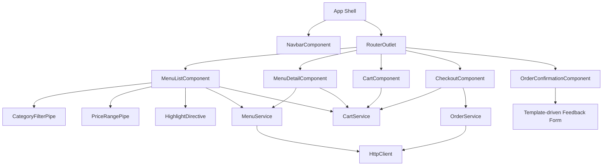

# Component Hierarchy Diagram

```mermaid
graph TD
  App[App Shell]
  Navbar[NavbarComponent]
  Router[RouterOutlet]

  App --> Navbar
  App --> Router

  Router --> MenuList[MenuListComponent]
  Router --> MenuDetail[MenuDetailComponent]
  Router --> Cart[CartComponent]
  Router --> Checkout[CheckoutComponent]
  Router --> Confirmation[OrderConfirmationComponent]

  MenuList --> CatPipe[CategoryFilterPipe]
  MenuList --> PricePipe[PriceRangePipe]
  MenuList --> Highlight[HighlightDirective]

  MenuList --> MenuService[MenuService]
  MenuDetail --> MenuService
  MenuList --> CartService[CartService]
  MenuDetail --> CartService
  Cart --> CartService
  Checkout --> CartService

  Checkout --> OrderService[OrderService]
  Confirmation --> Feedback[Template-driven Feedback Form]

  OrderService --> Http[HttpClient]
  MenuService --> Http
```
